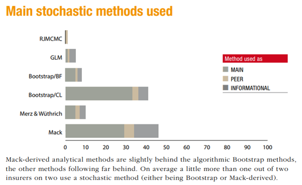

```{r setup, include=FALSE}
options(htmltools.dir.version = FALSE)

library(tidyverse)
library(reservetestr)

ggSetTheme()

```

class: left, top

# Agenda

.font200[

- The problem
- The solution?
- R package: `reservetestr`
- The results
- The future

]

---

# Links

.font150[

R package: https://github.com/problemofpoints/reservetestr

Presentation: 

]

---

class: inverse, left, middle

# The problem

---

class: left, top

# Reserve risk is material...

```{r, echo=FALSE}

```

---

# Reserve risk is material...

```{r, echo=FALSE}

```

---

# ...but it's hard to estimate!

```{r, echo=FALSE}

```

---

# ...but it's hard to estimate!

```{r, echo=FALSE}

```

---

# And some don't appreciate that...

```{r, echo=FALSE}

```

---

class: inverse, left, middle

# The solution?

---

class: left, top

# The solution? Traditional stochastic reserving methods

```{r, echo=FALSE}

```

---

# But are they accurate? We can test that!

```{r, echo=FALSE}

```

---

# Meyers's Monograph

```{r, echo=FALSE}

```

---

# Back-testing methodology

```{r, echo=FALSE}

```

---

# Back-testing methodology

```{r, echo=FALSE}
knitr::include_graphics("img/uniform-test2.png")
```

---

# Monograph summary and conclusion

```{r, echo=FALSE}

```

---

class: inverse, left, middle

# R package: reservetestr

---

class: left, top

# Me trying to replicate results

```{r, echo=FALSE}

```

---

# So build an R package!

.font150[

- `reservetestr` package
  - Work in progress
  - https://github.com/problemofpoints/reservetestr

]

---

# Example: "training data"

```{r sample-data-train, fig.cap="Sampe Paid Loss Triangle - Training data"}
cas_loss_reserve_db %>%
  get_meyers_subset() %>%
  filter(line == "ppauto" & group_id == 388) %>%
  pluck("train_tri_set", 1, "paid")
```

---

# Example: "testing data"

```{r sample-data-test, fig.cap="Sampe Paid Loss Triangle - Testing data"}
cas_loss_reserve_db %>%
  get_meyers_subset() %>%
  filter(line == "ppauto" & group_id == 388) %>%
  pluck("test_tri_set", 1, "paid")
```

---

# Example: Commercial Auto

Now we can run the Mack method on our triangle training data and back-test its accuracy. We use the implementation of the Mack method in the `ChainLadder` package, `MackChainLadder`, applied to the `comauto` line of business.


```{r backtest-mack-example, warning=FALSE, message=FALSE}
cas_db_subset <- cas_loss_reserve_db %>%
  get_meyers_subset()

mack_paid_results <- run_single_backtest(cas_db_subset, 
                                         testr_MackChainLadder, 
                                         lines_to_include = "comauto",
                                         loss_type_to_backtest = "paid", 
                                         method_label = "mack_paid")
```

---

# Example: Commercial Auto - output

```{r mack-glimpse}
glimpse(mack_paid_results)
```

---

# Example: Commercial Auto - results

```{r mack-exhibits-pp-example}
create_pp_plot(mack_paid_results, by_line = TRUE)
```

---

class: inverse, left, middle

# The competition

---

class: left, top

# The competition

- Test several methods on both paid and case-incurred triangles
--

- All methods from the `ChainLadder` package for now
  - MackChainLadder
  - BootChainLadder
  - ClarkCapeCod
--

- Show results from Meyers's Changing Settlement Rate (CSR) method
--

- Declare winners?

---

# Mack - Paid

```{r backtest-mack, warning=FALSE, message=FALSE, echo=FALSE}
mack_paid_results_all <- run_single_backtest(cas_db_subset, 
                                         testr_MackChainLadder, 
                                         loss_type_to_backtest = "paid", 
                                         method_label = "mack_paid")
```
```{r mack-exhibits-pp, echo-FALSE, fig.width=10, fig.height=8}
create_pp_plot(mack_paid_results_all, by_line = TRUE)
```

---

# Mack - Case-Incurred

```{r backtest-mack2, warning=FALSE, message=FALSE, echo=FALSE}
mack_case_results_all <- run_single_backtest(cas_db_subset, 
                                         testr_MackChainLadder, 
                                         loss_type_to_backtest = "case",
                                         method_label = "mack_case")
```
```{r mack-exhibits-pp2, echo-FALSE, fig.width=10, fig.height=8}
create_pp_plot(mack_case_results_all, by_line = TRUE)
```

---

# ODP Bootstrap - Paid

```{r backtest-boot, warning=FALSE, message=FALSE, echo=FALSE}
boot_paid_results_all <- run_single_backtest(cas_db_subset, 
                                         testr_BootChainLadder, 
                                         loss_type_to_backtest = "paid", 
                                         method_label = "boot_paid")
```
```{r boot-exhibits-pp, echo-FALSE, fig.width=10, fig.height=8}
create_pp_plot(boot_paid_results_all, by_line = TRUE)
```

---

# ODP Bootstrap - Case-Incurred

```{r backtest-boot2, warning=FALSE, message=FALSE, echo=FALSE}
boot_case_results_all <- run_single_backtest(cas_db_subset, 
                                         testr_BootChainLadder, 
                                         loss_type_to_backtest = "case",
                                         method_label = "boot_case")
```
```{r boot-exhibits-pp2, echo-FALSE, fig.width=10, fig.height=8}
create_pp_plot(boot_case_results_all, by_line = TRUE)
```

---

# Clark Cape Cod - Paid

```{r backtest-clark, warning=FALSE, message=FALSE, echo=FALSE}
clark_paid_results_all <- run_single_backtest(cas_db_subset, 
                                         testr_ClarkCapeCod, 
                                         loss_type_to_backtest = "paid", 
                                         method_label = "clark_paid",
                                         maxage = 120)
```
```{r clark-exhibits-pp, echo-FALSE, fig.width=10, fig.height=8}
create_pp_plot(clark_paid_results_all, by_line = TRUE)
```

---

# Clark Cape Cod - Case-Incurred

```{r backtest-clark2, warning=FALSE, message=FALSE, echo=FALSE}
clark_case_results_all <- run_single_backtest(cas_db_subset, 
                                         testr_ClarkCapeCod, 
                                         loss_type_to_backtest = "case",
                                         method_label = "clark_case",
                                         maxage=120)
```
```{r clark-exhibits-pp2, echo-FALSE, fig.width=10, fig.height=8}
create_pp_plot(clark_case_results_all, by_line = TRUE)
```

---

# Changing Settlement Rate - Paid

```{r, echo=FALSE}

```

---

class: inverse, left, middle

# The future

---

# reservetestr enhancements

.font150[
- Add error metrics for deterministic methods
- Create an object structure using S3 class system
- Add more error handling
- Add `testr_` functions for the other methods in `ChainLadder`
- Add ability to test several methods at once
]

